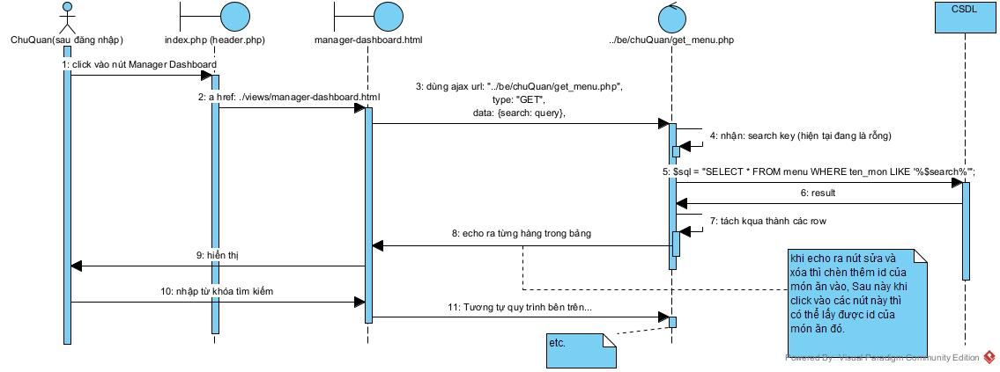
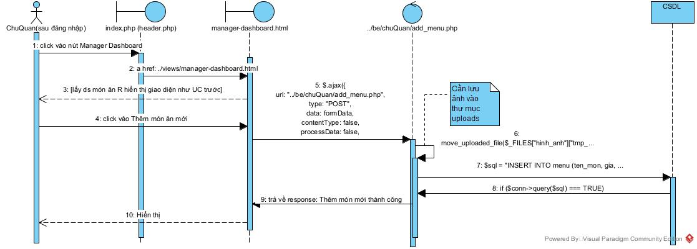
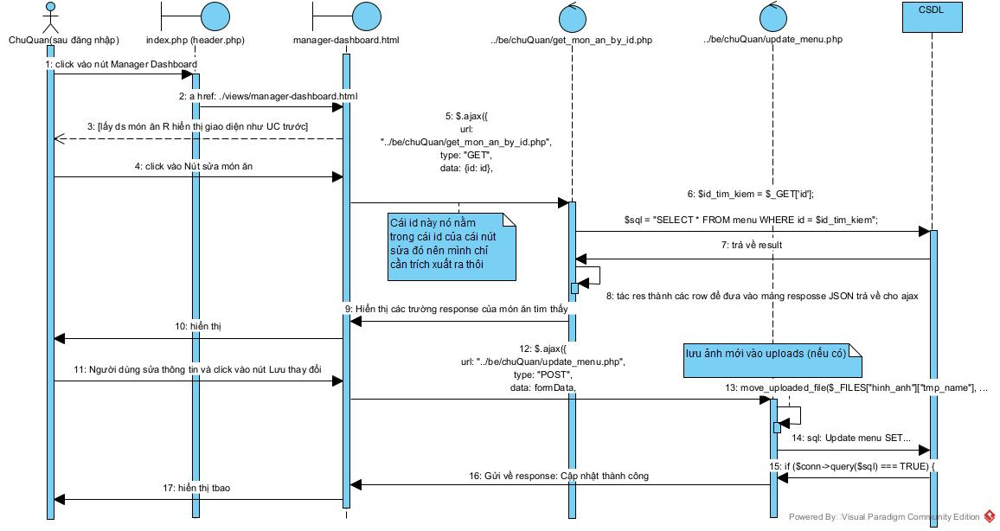
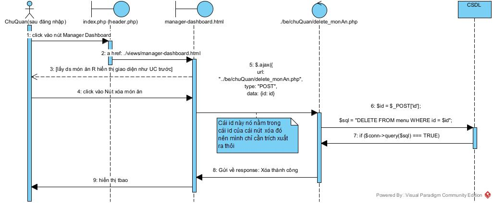

<h1 align="center"> Quản lý quán </h1>

# Giao diện
**Nhớ kiểm tra phiên xem có đúng role là chủ quán ko thì mới cho vào các view của manager dashboard????
Trong giao diện quản lý quán `manager-dashboard.html` mặc định có các trang:
- Quản lý menu:
  - Có một nút thêm món ăn mới. (click vào -> một modal boostrap hiện lên để thao tác nhập dữ liệu: tên món, giá, loại, hiển thị: on/off để chọn trạng thái có hiển thị món trên menu hay không, mô tả: số lượng hoặc Khối lượng, một trường upload ảnh để chọn ảnh)
  - Có một nút tìm kiếm món ăn trong danh sách món.
  - Có một danh sách món ăn được lấy ra từ trong CSDL. Mỗi món sẽ có các chức năng là: ẩn hiện món ăn trong menu thực đơn, sửa và xóa món ăn.
- Thống kê:

# Luồng thực hiện
## CSDL `quan_an_db2024`:

## Luồng thực hiện

### Hiển thị DS các món ăn trong CSDL & tìm kiếm

### Thêm món ăn mới vào CSDL

### Sửa món ăn

### Xóa món ăn

