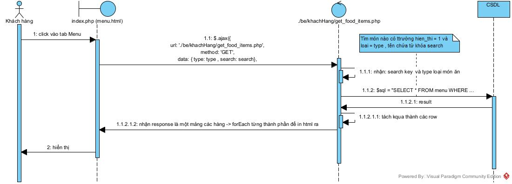
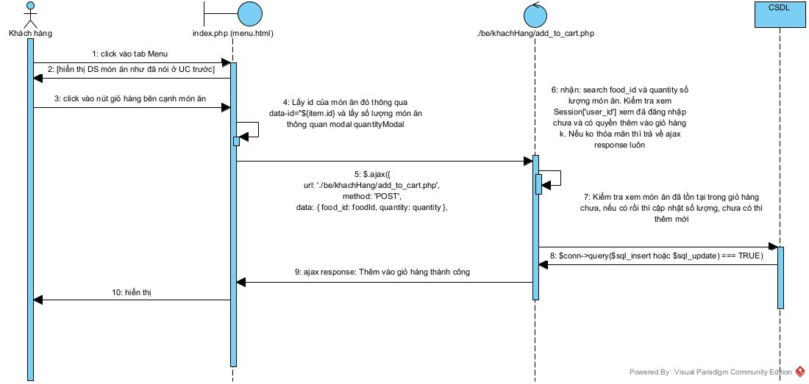

<h1 align="center"> Khách hàng Xem menu và Đặt hàng </h1>

# Luồng thực hiện
## CSDL `quan_an_db2024`:

## Luồng thực hiện

### Hiển thị DS các món ăn trong CSDL (Những món được hiển thị) & tìm kiếm, phân loại món ăn

### Thêm món ăn vào Giỏ hàng

### Xem và Sửa giỏ hàng (sửa số lượng món)

<!--  -->

### Xóa món ăn trong giỏ hàng

<!--  -->

### Đặt hàng

