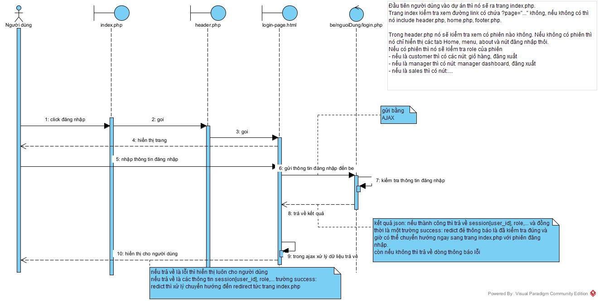

<h1 align= "center"> Giải thích cách hoạt động</h1>

# Login
- Trang `views/login-page.html` gửi POST đến `login.php` bằng AJAX
<details>
<summary> Sự khác nhau giữa gửi bằng form thường và AJAX là: (Form Action) gửi yc đi và nhận về cả một trang (HTML) mới, còn AJAX thì gửi yc POST đi và nhận về nội dung (thường là JSON) mà vẫn giữ nguyên các thành phần của trang cũ </summary>
Để giúp bạn hiểu rõ hơn về luồng thực hiện của AJAX và cách nó khác với việc gửi dữ liệu bằng form thông thường, hãy cùng so sánh hai phương pháp này:

### 1. Gửi Dữ Liệu Bằng Form Thông Thường (Form Action)

Khi bạn sử dụng phương thức POST với form thông thường, quá trình diễn ra như sau:

1. **Người dùng điền thông tin vào form** và nhấn nút "Submit".
2. **Trình duyệt gửi yêu cầu POST** đến URL được chỉ định trong thuộc tính `action` của form.
3. **Máy chủ xử lý yêu cầu** và trả về một trang HTML mới.
4. **Trình duyệt tải lại trang** với nội dung mới từ máy chủ.

Ví dụ:

```html
<form method="POST" action="login.php">
    <input type="text" name="username" placeholder="Username">
    <input type="password" name="password" placeholder="Password">
    <button type="submit">Login</button>
</form>
```

### 2. Gửi Dữ Liệu Bằng AJAX

AJAX (Asynchronous JavaScript and XML) cho phép bạn gửi yêu cầu đến máy chủ mà không cần tải lại trang. Quá trình diễn ra như sau:

1. **Người dùng điền thông tin vào form** và nhấn nút "Submit".
2. **JavaScript chặn sự kiện submit** của form và gửi yêu cầu AJAX đến máy chủ.
3. **Máy chủ xử lý yêu cầu** và trả về dữ liệu (thường là JSON).
4. **JavaScript xử lý phản hồi** từ máy chủ và cập nhật nội dung trang web mà không cần tải lại trang.

Ví dụ:

```html
<!DOCTYPE html>
<html lang="vi">
<head>
    <meta charset="UTF-8">
    <title>Login</title>
    <script src="https://code.jquery.com/jquery-3.6.0.min.js"></script>
    <script>
        $(document).ready(function() {
            $("form").submit(function(event) {
                event.preventDefault(); // Ngăn chặn form gửi thông thường

                $.ajax({
                    type: "POST",
                    url: "login.php", // Đường dẫn đến file login.php
                    data: $(this).serialize(),
                    dataType: "json",
                    success: function(response) {
                        if (response.status === 'success') {
                            window.location.href = response.redirect;
                        } else {
                            $("#login_alert").html(response.message);
                        }
                    },
                    error: function() {
                        $("#login_alert").html("Có lỗi xảy ra. Vui lòng thử lại.");
                    }
                });
            });
        });
    </script>
</head>
<body>
    <form method="POST">
        <p id="login_alert" class="mb-5 pb-lg-2" style="color: #ff2323"></p>
        <input type="text" name="username" placeholder="Username">
        <input type="password" name="password" placeholder="Password">
        <button type="submit">Login</button>
    </form>
</body>
</html>
```

### Sự Khác Biệt Chính

- **Tải lại trang**: Form thông thường sẽ tải lại trang sau khi gửi yêu cầu, trong khi AJAX không tải lại trang mà chỉ cập nhật phần cần thiết.
- **Trải nghiệm người dùng**: AJAX mang lại trải nghiệm mượt mà hơn vì không cần tải lại toàn bộ trang.
- **Xử lý phản hồi**: Với AJAX, bạn có thể xử lý phản hồi từ máy chủ ngay lập tức và cập nhật giao diện người dùng mà không cần tải lại trang.

Hy vọng giải thích này giúp bạn hiểu rõ hơn về luồng thực hiện của AJAX và sự khác biệt so với việc gửi dữ liệu bằng form thông thường. Nếu bạn có thêm câu hỏi nào khác, hãy cho tôi biết nhé!
</details>

- Sau khi nhận được thông tin đăng nhập từ `views/login-page.html` thì `login.php` sẽ kiểm tra sự tồn tại của username có ứng với password không. 
- Nếu thỏa mãn, nó sẽ tạo ra một phiên đăng nhập và đồng thời gửi cho `views/login-page.html` một response json là chuyển hướng đến trang index.php. Khi này trang index.php gọi đến `includes/header.php` và tại đây nó sẽ kiểm tra phiên đăng nhập và sẽ hiển thị các chức năng trên navbar tương ứng với vai trò của người dùng.
- Nếu username,password mà sai thì nó sẽ gửi cho `views/login-page.html` một response json là đăng nhập thất bại do sai username,password. 



# Logout
Từ phần navbar tại `includes/header.php` nếu click vào đăng xuất sẽ được chuyển hướng đến file `logout.php`.

Trong file này có chứa phần hủy session id hiện tại đi và quay trở lại với trang `index.php`

Khi này đã quay lại trường hợp là trang `index.php` gọi đến `includes/header.php` và `includes/header.php` sẽ kiểm tra xem có phiên nào không → không có phiên thì hiển thị nút đăng nhập


# Register
Từ trang login được chuyển hướng đến trang Register nếu như người dùng chưa có tài khoản. 

Khi này tương tự với trang đăng nhập, trang đăng ký cũng có một form gồm các thông tin như: username, số điện thoại, password, nhập lại password.

Phía FE cần đảm bảo 2 điều sau trước khi gửi form xuống cho BE xử lý:
- số điện thoại đúng là số chứ không chứa ký tự (có thể xử lý chặt chẽ hơn: giới hạn bao nhiêu số,...).
- lần nhập lại password phải giống password trước đó.

Khi đã đảm bảo thì dùng AJAX để gửi yc POST đến `register.php` để kiểm tra thông tin đăng ký có đảm bảo rằng người dùng này chưa từng tồn tại không (nếu trùng sdt thì người này đã tồn tại).

Nếu người dùng chưa tồn tại,  `register.php` sẽ lưu thông tin người dùng vào csdl và gửi thông báo thành công cho FE.

